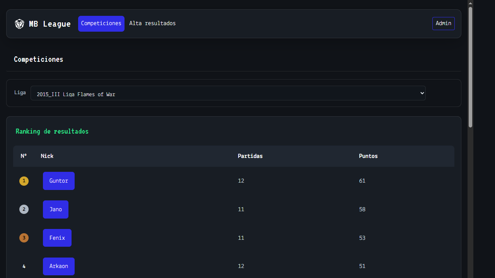
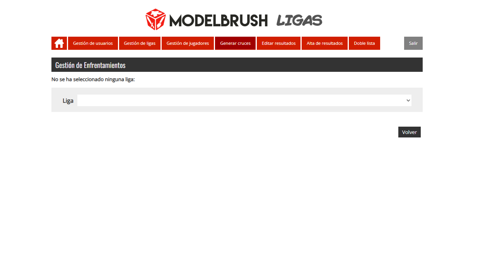
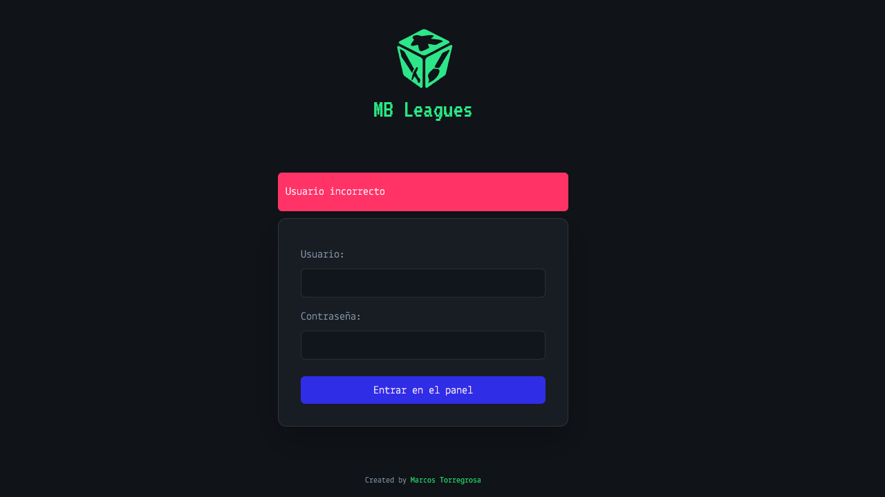

# League Manager

League Manager is a PHP application for managing tabletop wargaming leagues and campaigns. It stores leagues, games, factions, players, army lists, rounds, matches and results in MySQL.

## What the application does

- Manage games and their factions.
- Create and configure leagues, phases and rounds.
- Register players and assign them to leagues and factions.
- Upload or link army lists for each player and phase.
- Generate match pairings and display round information.
- Enter, validate and edit match results.
- Record painting scores, sportsmanship scores and secondary missions.
- Generate random factions for matches using the double-list workflow.
- Manage users, roles and league permissions.
- Display league progress, rankings, player lists and match data.
- Provide embeddable league data for external websites.

## Screenshots

The following thumbnails show the main authenticated sections of the application. Open any image to view the full-size screenshot.

<table>
	<tr>
		<td><a href="docs/screenshots/leagues.png"></a></td>
		<td><a href="docs/screenshots/matches.png"></a></td>
		<td><a href="docs/screenshots/double-list.png"></a></td>
	</tr>
</table>

## Implementation

The application is a server-rendered PHP MVC-style application with a legacy codebase. Its main layers are:

- `model/`: data objects used by the application.
- `controller/`: database operations and application rules for users, leagues, phases, players, games, factions and matches.
- `config/`: database access, logging and application configuration.
- `ajax/`: asynchronous endpoints used by dynamic forms and selectors.
- `inc/`: embeddable PHP components for external pages.
- Root PHP files: authenticated screens and workflows exposed to users.
- `recursos/css/`: shared styles.
- `recursos/js/`: jQuery, jQuery UI, calendars, validation and other frontend libraries.
- `images/` and `recursos/img/`: application and league assets.

The database layer uses `mysqli`. Existing application table and column names are retained for compatibility with the controllers and external integrations.

## Requirements

- PHP 8.4 or a compatible PHP version with the `mysqli` extension.
- MySQL 5.5 or later.
- A web server capable of running PHP. PHP's built-in development server is sufficient for local testing.
- A browser with JavaScript enabled for AJAX forms, responsive navigation and calendars.

## Local setup

1. Create the local database credentials file:

	```text
	Copy config/db.credentials-template.php to config/db.credentials.php
	```

2. Set the MySQL server, username, password and database name in `config/db.credentials.php`.

3. Create the schema and load dummy data:

	```text
	mysql -u YOUR_USER -p < sql/schema.sql
	mysql -u YOUR_USER -p mb_league < sql/seed.sql
	```

	The scripts can also be run from another MySQL client. `schema.sql` creates the `mb_league` database and all application tables. `seed.sql` inserts English dummy data for local development.

4. Start the local PHP server from the project directory:

	```text
	php -S 127.0.0.1:8000 -t .
	```

5. Open `http://127.0.0.1:8000/` in a browser.

The dummy dataset includes an administrator account with the credentials `admin` / `admin`. Change or remove dummy accounts before using the application outside a local environment.

## Database scripts

- `sql/schema.sql` is the DDL script. It creates the database, tables, indexes and foreign keys.
- `sql/seed.sql` is the DML script. It inserts games, factions, users, leagues, phases, permissions, players, lists, missions and matches.

The SQL scripts are intended for a clean local database. Review them before applying them to an existing or production database.

## External integrations

The files in `inc/` are designed to be included by other PHP pages to display league results and data. They provide reusable views for rounds, player lists, league progress and rankings.

An external PHP page can include a component with `include` or `require`, providing the variables required by that component, such as `$idLiga`. The component must be able to resolve the project path and must have access to `config/db.credentials.php` in the target environment.

`pintar_tablas.php` is another embeddable reporting entry point for rendering league tables.

## Logging

The `Log` singleton in `config/log.class.php` centralizes application error logging. Controllers use it when an exception or database error is caught. Log entries include:

- The `ERROR` marker.
- The date and time.
- The controller or operation that reported the error.
- The exception message, when available.
- The request URI.

The default log file is `log.log` in the project root. It is generated locally and excluded from Git. Before each new log entry, records older than 30 days are removed automatically. Lines that do not match the application log format are preserved. Ensure that the PHP process has permission to create and write to this file.

## Security notes

- Never commit `config/db.credentials.php`.
- Use a dedicated MySQL user with only the permissions required by the application.
- Replace all dummy credentials before deployment.
- The legacy application stores user passwords using MD5; production deployments should migrate to a modern password hashing strategy such as `password_hash()` and `password_verify()`.
- Review file upload, session, mail and database settings before exposing the application publicly.

## Repository exclusions

`.gitignore` excludes local database credentials, the `.mysql-test-data/` directory created by the MySQL test environment, and the generated `log.log` file. The SQL schema, seed data and application source remain versionable.
